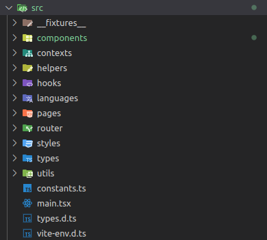

# Hostfully Assessment

Project written using Vite + Typescript and all unit tests are developed using Vitest + React Testing Library.

## Prerequisites

- Node.js (min version 18.18)
- Yarn 1.22

## Installation

```js
yarn install
```

## How to run the project?

```js
yarn dev
```

## How to run all unit tests?

```js
yarn test
```

## How to run the unit tests coverage?

```js
yarn coverage
```

When this command is ran, a folder called 'coverage' is created in the root of the project and you can check all the information regarding coverage on there.

Obs.: The current coverage of the unit testing is above 90%.

## Current architecture



- I decided to use 'Context API' to handle the booking data across all the components ('contexts' folder)
- All the components are under the 'components' folder and each one of them contains its own test folder
- I created the 'helpers' folder with some functions that support the logic inside of the components
- The 'hooks' folder was created to move some huge logic of the component, let the component with the unique responsibility to show the component (Separation of concern)
- To handle with i18n the 'languages' folder was created (current only en-US keys are being used)
- There is only one page to this application
- The 'styles' folder contains all the tokens used in the application and the default styling.
- And the 'utils' folder contains a function that apply the theme in the tests
